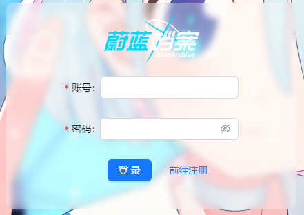

### 盒子毛玻璃效果

---

#### 效果



#### 代码

```css
/* 目标盒子 */
backdrop-filter: blur(5px);
background-color: rgba(255, 255, 255, 0.3);
```

#### 扩展

`backdrop-filter`

CSS 中的一个样式过滤器属性，它可以对元素背后的区域添加图形效果，这样元素后面的内容会透过滤镜效果显示出来。

**其它属性**

```css
/* 调整背景颜色 */
backdrop-filter: saturate(180%);
/* 添加亮度 */
backdrop-filter: brightness(0.8);
/* 创建灰度效果 */
backdrop-filter: grayscale(100%);
/* 反转颜色 */
backdrop-filter: invert(100%);
/* 多重滤镜合成 */
backdrop-filter: blur(5px) saturate(150%);
```
